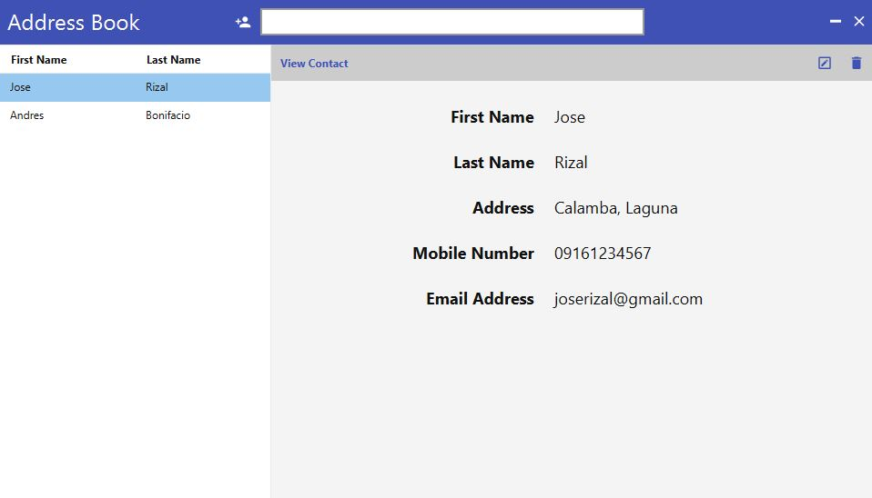
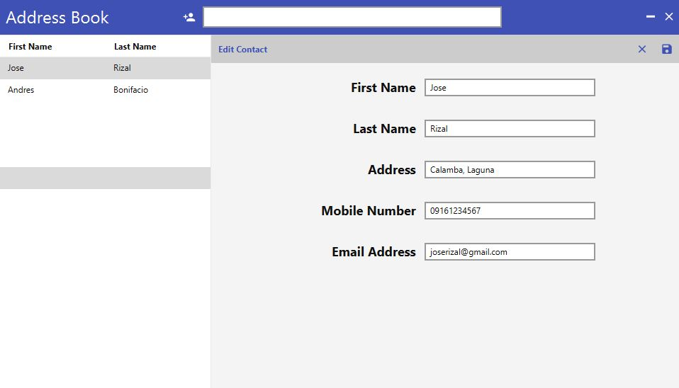
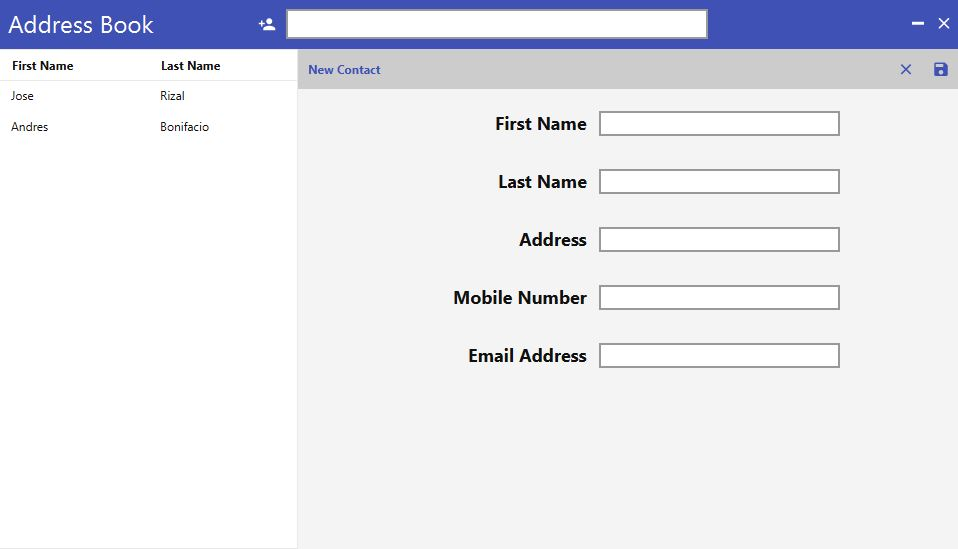
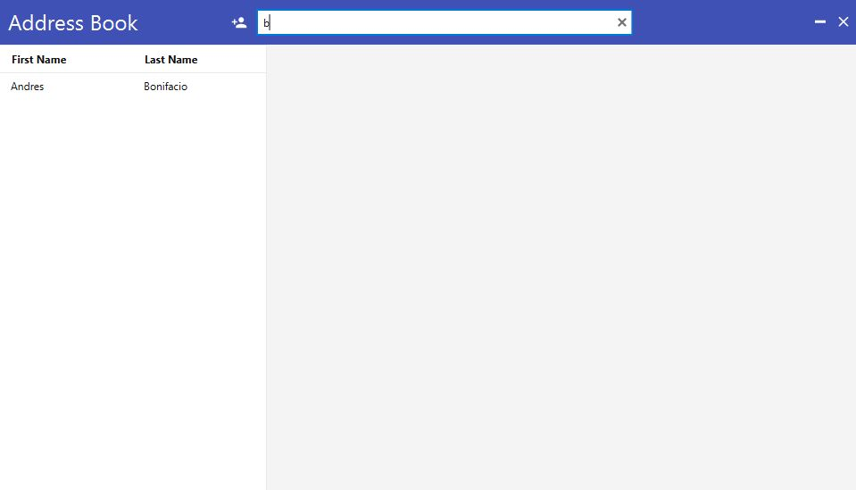
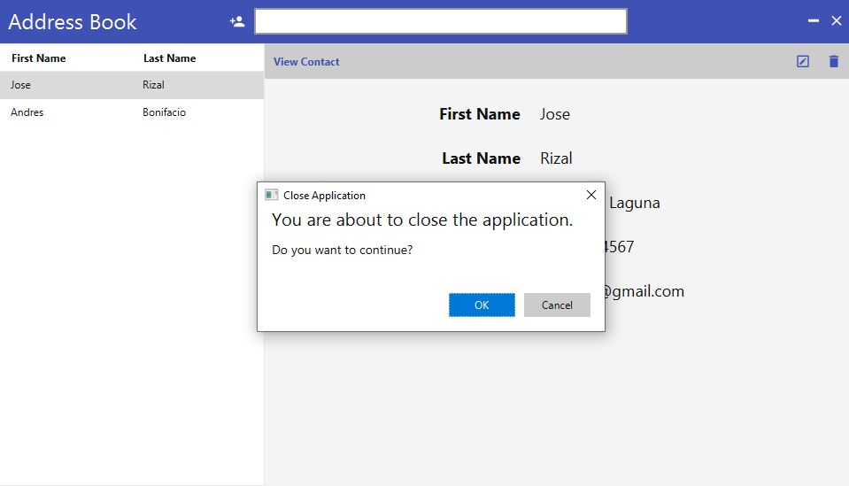

# addressbook-javafx
Address book application written in Java and JavaFX. 

Other technologies used: JMetro, Ikonli, H2 Database Engine, Hibernate ORM (JPA), Hibernate Validator (Bean Validation, and HikariCP.

## Clone

```bash
$ git clone https://github.com/julianjupiter/addressbook-javafx
```

# Database

Database file, `./data/sgs.mv.db`, is automatically created upon running the application. 

`Note: Only one instance of application should be running as the database cannot be accessed by multiple client.`

The database file can also be opened by any database client/manager (I recommend `DBeaver`) that is capable of connecting to H2 database. User: `sa` and password: `secret`. Make sure address book application is not running when opening the database file.

## Build and Run

- GNU/Linux, UNIX

```bash
$ cd addressbook-javafx
$ ./mvnw clean package
$ java -jar java -jar ./target/addressbook-javafx-0.0.2.jar
```

- Windows

```bash
> cd addressbook-javafx
> .\mvnw clean package
> java -jar java -jar .\target\addressbook-javafx-0.0.2.jar
```

## Screenshots

#### Start


#### View Contact


#### Edit Contact


#### Add Contact


#### Search Contact


#### Delete Contact


#### Close Application

